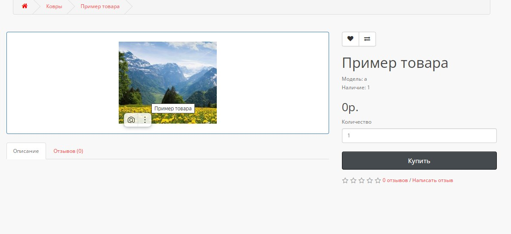
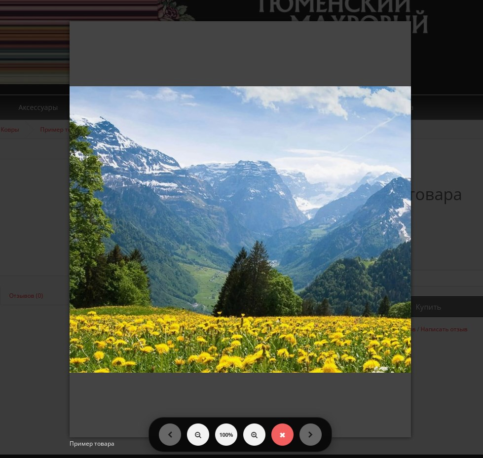

# Enhanced Product Image Viewer for OpenCart

Модификация для улучшенного просмотра изображений товаров в OpenCart с функционалом масштабирования и перетаскивания.

## 🚀 Возможности

### 📸 Улучшенный просмотр изображений
- **Масштабирование** - приближение/отдаление кнопками или колесиком мыши
- **Перетаскивание** - перемещение увеличенного изображения мышью или пальцем
- **Навигация по галерее** - удобные кнопки для переключения между изображениями
- **Исходное качество** - просмотр изображений в полном разрешении

### 🎯 Удобное управление
- **Единая панель управления** - все кнопки расположены внизу экрана
- **Защита от случайного закрытия** - попап закрывается только по кнопке
- **Адаптивный дизайн** - корректная работа на мобильных устройствах
- **Интуитивные иконки** - понятный интерфейс управления

### 🛡️ Надежность
- **Стабильная работа** - отсутствие конфликтов с существующим кодом
- **Оптимизированная производительность** - плавная анимация и быстрая загрузка
- **Совместимость** - работает с любыми темами OpenCart


 
## 📁 Измененные файлы

### 1. Контроллер продукта
```
catalog/controller/product/product.php
```
**Изменения:**
- Добавлены URL оригинальных изображений
- Подключение библиотек Magnific Popup

### 2. Шаблон продукта
```
catalog/view/theme/your-theme/template/product/product.twig
```
**Изменения:**
- Обновленная разметка для изображений
- JavaScript для функционала зума и перетаскивания
- CSS стили для кастомных контролов

### 3. Заголовок (опционально)
```
catalog/controller/common/header.php
catalog/view/theme/your-theme/template/common/header.twig
```
**Для иконок:**
- Подключение Font Awesome 6

product.twig и product.php  измененный выложены в репозитории
